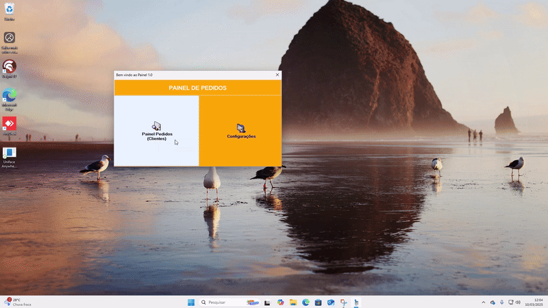

Painel de Acompanhamento de Pedidos (via TOTVS MODA)
## Funcionalidades

Esse Painel foi desenvolvido para o acompanhaento da situação dos pedidos que são gerados no TOTVS MODA e a partir de um arquivo que o programa da TOTVS gera esse painel identifica
e faz a organização dos pedidos dos clientes.

## 🎥 Demonstração do Projeto

