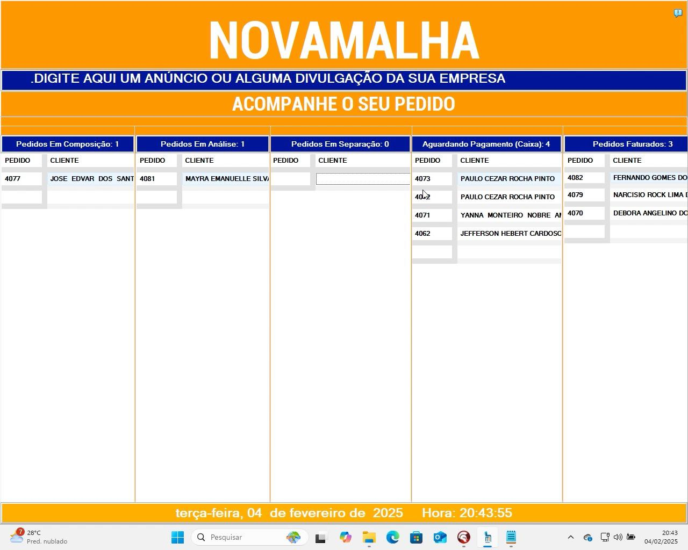

Painel de acompanhamento de Pedidos feito em Delphi
## Uso
Esse painel foi criado para o acompanhamento de pedidos que são lançados no TOTVS MODA, ele pega as informações do sistema da TOTVS e através da atualização da situação do pedido
ele carrega no painel.
[

